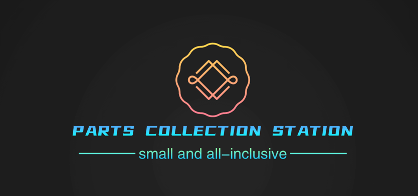

# Parts Collection Station

    

汇集更多有价值的mvp

  
  
  
  

## 任务清单

✅ 已完成
⭐️ 完善中
❌ 未开始
### JS
- JavaScript弹窗插件
https://www.jq22.com/yanshi23886
- Layout 布局 ❌
- Icon 图标 ❌

### CSS效果
- 呼吸效果

### 技术方案demo
- 页面流程回溯的实现 ⭐️

### Vue组件
- Table 表格 ❌
- tree 树 ❌
- Tag 标签 ❌
- Progress 进度条 ❌
- Pagination 分页 ❌
- Badge 标记 ❌

### 工具方法

- 日期格式化 ❌

### 优秀代码块

## LICENSE

[MIT](https://en.wikipedia.org/wiki/MIT_License)

